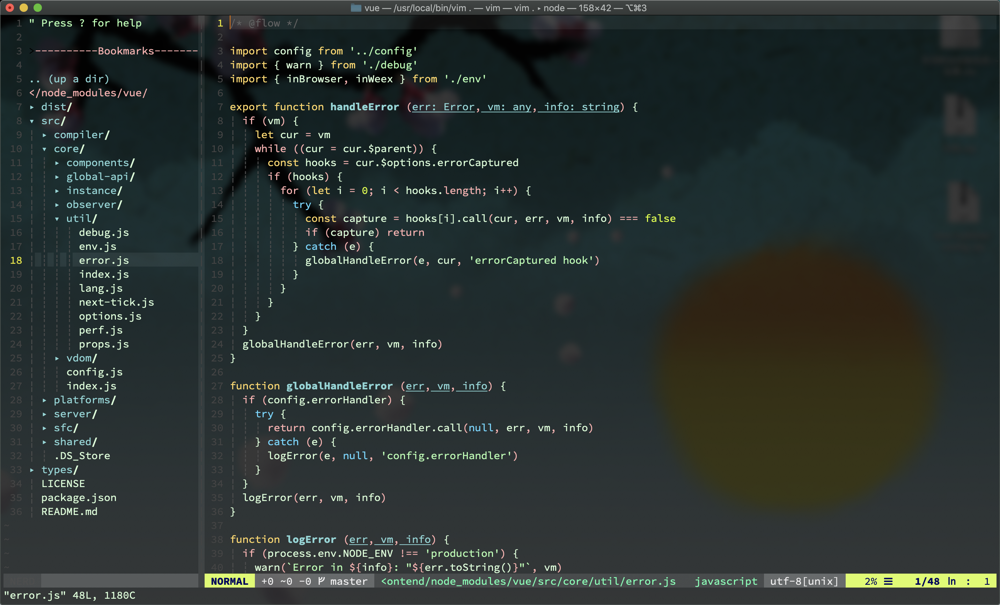

# sai vim colors

A vim color theme for myself, same for you if you like.



## Installation

### Vundle

Add the following to your `~/.vimrc` file and run `PluginInstall` in Vim.

```shell
Plugin 'diandian18/sai-vim-colors'
```

### vim-plug

Add the following to your `~/.vimrc` file and run `PlugInstall` in Vim.

```shell
Plug 'diandian18/sai-vim-colors'
```

### Pathogen

```shell
cd ~/.vim/bundle
git clone git@github.com:diandian18/sai-vim-colors.git
```

### Manual

```shell
cd ~/.vim/colors
git clone git@github.com:diandian18/sai-vim-colors.git
cp ./sai-vim-colors/colors/sai-vim-colors.vim .
```

## Use

Add the following to your `~/.vimrc` file

```shell
colo sai-vim-colors
```
